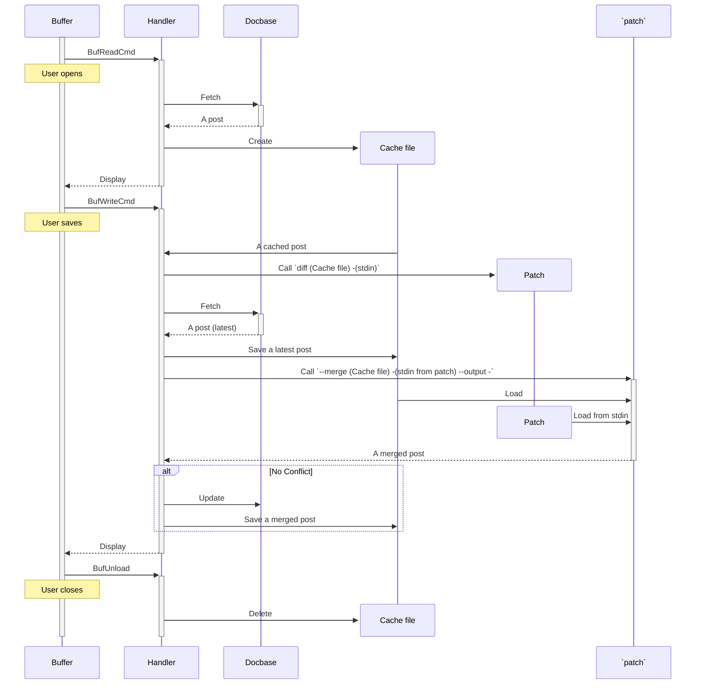

# design

## 競合の解消

ローカルでの変更とリモートでの変更の競合を解消する流れを以下に示す。

```mermaid
sequenceDiagram
    participant Buffer
    participant Handler
    participant Docbase

    activate Buffer
    Buffer ->> +Handler: BufReadCmd
    Note over Buffer: User opens

    Handler ->> +Docbase: Fetch
    Docbase -->> Handler: A post
    deactivate Docbase

    create participant Cache as Cache file
    Handler ->> Cache: Create

    Handler -->> Buffer: Display
    deactivate Handler

    Buffer ->> +Handler: BufWriteCmd
    Note over Buffer: User saves

    Cache ->> Handler: A cached post

    create participant P as Patch
    Handler ->> P: Call `diff (Cache file) -(stdin)`

    Handler ->> +Docbase: Fetch
    Docbase -->> Handler: A post (latest)
    deactivate Docbase

    Handler ->> Cache: Save a latest post

    participant patch as `patch`
    Handler ->> +patch: Call `--merge (Cache file) -(stdin from patch) --output -`
    Cache ->> patch: Load
    destroy P
    P ->> patch: Load from stdin
    patch -->> Handler: A merged post
    deactivate patch

    alt No Conflict
        Handler ->> Docbase: Update
        Handler ->> Cache: Save a merged post
    end
    Handler -->> Buffer: Display
    deactivate Handler

    Buffer ->> +Handler: BufUnload
    Note over Buffer: User closes
    destroy Cache
    Handler ->> Cache: Delete
    deactivate Handler
    deactivate Buffer
```
